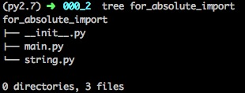

# python2.x __future__ 讲解


在python2.x 版本下有一个__future__模块，该某块主要是为兼容python3的一些特性，提供了一些方法。

##absolute_import

    该方法不是支持了绝对引入，而是拒绝隐式引入。什么意思哪？一个项目都是由一个团队来进行开发，有可能你开发的模块和其他人开发的模块名称相同，或者你定义的名称和系统有冲突。这样就会出现问题，并且排查起来比较困难。absolute_import 方法功能是，当你绝对应用的时候，从python 系统引入，而不再从你的项目进行引入。下面来举个例子：
    


上图是该实例的目录结构。

```
root@localhost# cat for_absolute_import/string.py
                a=1
root@localhost# cat for_absolute_import/main.py
                import string
```

如上是string.py 和main.py 两个文件代码，下面是用ipython交互终端测试.

```
In [1]: from for_absolute_import.main import string

In [2]: string.a
Out[2]: 1

```
在没有使用absolute_import方法，在main.py 文件使用绝对引用时,是从当前项目下引入的string.py模块。接下来改动一下main.py文件，然后再次调用。

```
root@localhost# cat for_absolute_import/main.py
   from __future__ import absolute_import
   import string
```

然后再次打开ipython终端进行测试。

```
In [1]: from for_absolute_import.main import string
In [2]: string
Out[2]: <module 'string' from '/System/Library/Frameworks/Python.framework/Versions/2.7/lib/python2.7/string.pyc'>
```

   现在在看，不在时从本项目进行引入了。而是从python环境饮用string模块。


##division
   python2.x 默认进行除法运算("/")，操作符号执行的是截断除法，如果使用division,则除法就是精准除法了。看下面实例:
   

```
In [1]: 3/2
Out[1]: 1
In [2]: from __future__
 import division
In [3]: 3/2
Out[3]: 1.5
```

##unicode_literals
   python2.x 字符串是以ASCII存储,python3.x开始都由unicode进行存储了.在python2.x下__future__模块提供了unicode_literals 方法使其将字符串转为unicode编码。
   
```
In [7]: a='你好'
In [8]: a
Out[8]: '\xe4\xbd\xa0\xe5\xa5\xbd'
In [9]: from __future__ import unicode_literals
In [10]: b="你好"
In [11]: b
Out[11]: u'\u4f60\u597d'
```

##print_function
   python从3.x开始就不在支持print语句了，而是由print语句改为print函数.所以python2.x __future__ 提供了print_function，禁止使用print语句.
    
```
In [1]: print "nihao"
nihao
In [2]: from __future__ import print_function
In [3]: print "nihao"
  File "<ipython-input-3-41542f2a9bb9>", line 1
    print "nihao"
                ^
SyntaxError: invalid syntax
In [4]: print('niaho')
niaho
```
当引用了print_function函数后,如果再使用print语句就会报错.

##其它
    除了以上几个方法外，还有nested_scopes、generators和with_statement方法。
    
    nested_scopes: 这个是修改嵌套函数或lambda函数中变量的搜索顺序，从"当前函数命名空间" -> "模块命名空间"的顺序更改为"当前函数命名空间"->"父函数命名空间"->"模块命名空间"的顺序。此功能从python2.7.5已经开始支持。
    generators: 生成器(yield)，python2.7.5中已经开始支持。
    with_statement: 是使用with关键字,python 3.7.5中已经开始支持。 